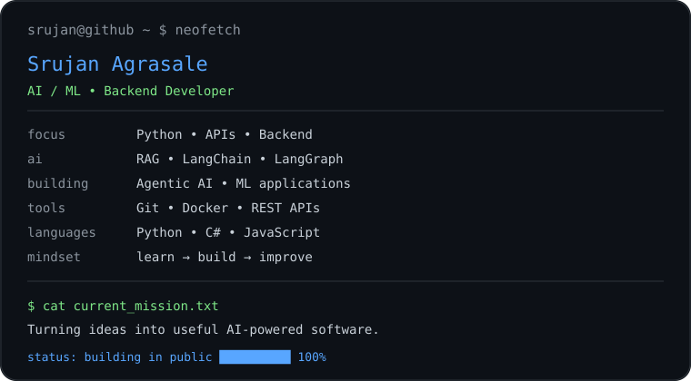

# 👋 Hi, I'm Srujan Agrasale

<p align="center">
  
</p>

<p align="center">
  
</p>

<p align="center">
  <a href="https://github.com/SrujanAgrasale01">GitHub</a> •
  <a href="https://www.linkedin.com/">LinkedIn</a> •
  <a href="mailto:your-email@example.com">Email</a>
</p>

---

## 🧠 What I Build

I like turning practical problems into **AI-powered, backend-driven software**.

- 🐍 Python & backend development
- 🤖 Machine Learning & AI applications
- 🔎 RAG systems and retrieval pipelines
- 🧩 LangChain / LangGraph workflows
- 🕸️ Agentic AI systems
- 🔌 REST APIs and integrations
- 🐳 Docker & developer tooling

## 🚀 Featured Projects

| Project | What it does |
|---|---|
| 🧠 [Breast Cancer Prediction using XAI](https://github.com/SrujanAgrasale01/Breast-cancer-prediction-using-XAI) | ML prediction with an Explainable AI focus |
| 🌱 [Reshme Namma Pride](https://github.com/SrujanAgrasale01/Reshme-Namma-Pride-) | Agricultural application combining Android, Gemini AI and offline support |
| 🔍 [Page Pulse](https://github.com/SrujanAgrasale01/page-pulse) | URL auditing tool using Node.js, Express and Cheerio |
| 🖼️ [Image Analysis using Deep Learning](https://github.com/SrujanAgrasale01/Image-Analysis-using-Deep-Learning) | YOLOv8-based image analysis application |
| 📊 [Zomato Restaurant Clustering](https://github.com/SrujanAgrasale01/zomato-restaurant-clustering) | Machine-learning clustering project |

## 🛠️ Tech Stack

<p>

</p>

**AI / ML:** Machine Learning · Deep Learning · XAI · RAG · LLMs · LangChain · LangGraph · Agentic AI

## 📈 Contribution Activity

<p align="center">
  
</p>

## ⚡ Current Direction

```text
Python
  ├── Backend & APIs
  ├── Machine Learning
  └── AI Engineering
       ├── RAG
       ├── LangChain
       ├── LangGraph
       └── Agentic AI
```

## 🎯 Goal

> Build software that is technically strong, genuinely useful, and easy for people to understand.

---

<p align="center">
  <i>Building. Learning. Experimenting. Shipping.</i>
</p>
